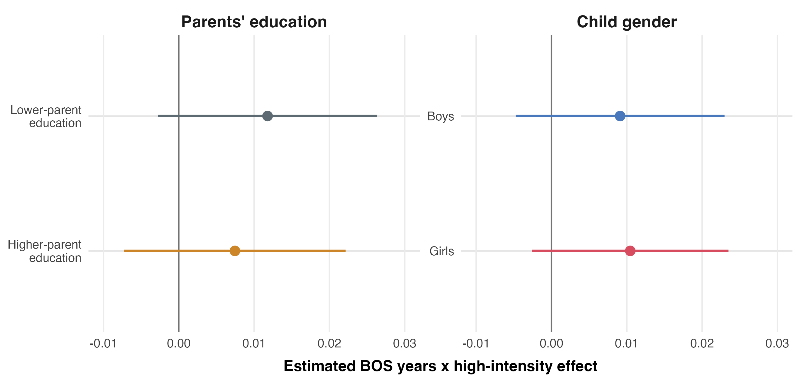

# Longer Exposure, Better Outcomes

## Replication Package for Evidence from Indonesia's BOS Program

**Author:** Gregy Tuerah

**Affiliation:** Harris School of Public Policy, University of Chicago

**Paper:** [Longer Exposure, Better Outcomes: Evidence from Indonesia's BOS Program](Paper/longer_exposure_better_outcomes.pdf)

This repository contains the replication code, reported outputs, and manuscript
for my master's thesis on Indonesia's *Bantuan Operasional Sekolah* (BOS)
school operational grant program.

## Research Question

Within the same family, do children with greater potential exposure to BOS have
better educational outcomes, particularly in provinces where measured
implementation intensity was stronger?

The analysis uses Indonesia Family Life Survey (IFLS) data and compares
siblings from the same origin household who differed in potential BOS exposure
because of their birth cohort. The preferred design combines:

- cumulative potential BOS-exposed school years based on the 2005 rollout;
- a province-level 2007 BOS implementation-intensity proxy constructed from
  IFLS school-facility information; and
- origin-household fixed effects with household-clustered standard errors.

The primary outcome is an indicator for completing at least 10 years of
schooling, interpreted as reaching the senior-high attainment threshold.

## Main Result

In the preferred specification, one additional potential BOS-exposed school
year in a higher-intensity province is associated with an approximately
**1 percentage point** higher probability of senior-high attainment relative
to lower-intensity provinces.

| Outcome / specification | Interaction estimate | Standard error | N |
| --- | ---: | ---: | ---: |
| Senior-high attainment, preferred specification | 0.010* | 0.006 | 2,088 |
| Completed years of schooling, preferred specification | -0.006 | 0.036 | 2,088 |

The result is interpreted cautiously. Sensitivity checks preserve a positive
sign under the older-cohort and top-tercile-intensity alternatives, but the
estimates are imprecise; the narrow-cohort-window estimate is negative and
imprecise.



## Repository Contents

| Directory | Contents |
| --- | --- |
| `Code/` | R scripts for sample construction, controls, balance, estimation, heterogeneity, robustness, and figures |
| `Data/README.md` | IFLS access instructions and exact required input files |
| `Output/Tables/` | Reported regression, balance, heterogeneity, and sensitivity tables |
| `Output/Figures/` | Figures used in the manuscript |
| `Paper/` | Paper PDF and LaTeX source materials |
| `docs/` | Workflow description, benchmark results, and software environment |

## Data Access

The IFLS data used for this study are available to registered users through
RAND. They are **not distributed in this repository**. RAND's public-use
conditions prohibit redistribution of the data files and require collaborators
who use them to register separately.

See [Data/README.md](Data/README.md) for the required files and folder layout,
and register/download the data through the
[RAND IFLS access page](https://www.rand.org/well-being/social-and-behavioral-policy/data/FLS/IFLS/access.html).

No person-level or household-level derived data are included in this public
package.

## Reproducing The Results

After obtaining the required IFLS files and placing them in the paths specified
in [Data/README.md](Data/README.md), run from the repository root:

```r
install.packages(c(
  "pacman", "haven", "dplyr", "knitr", "kableExtra", "tidyr",
  "fixest", "modelsummary", "ggplot2", "sf", "rnaturalearth",
  "ggrepel", "scales", "stringr"
))
install.packages(
  "rnaturalearthhires",
  repos = c("https://ropensci.r-universe.dev", getOption("repos"))
)
```

```bash
Rscript Code/run_main_thesis_pipeline.R
```

The core pipeline runs:

```text
01_Identification.R
01b_Controls.R
02_Balance.R
03_Regression.R
04_Manuscript_Figures.R
HTE-Robustness.R
99_Validate_Reported_Results.R
```

The pipeline regenerates the reported empirical tables and manuscript figures.
The final validation script checks that the regenerated principal estimates and
sample sizes match the results reported in the paper.

## Reported Outputs

- [Main senior-high attainment results](Output/Tables/main_model_2014_hs_cleaned.tex)
- [Main completed-years results](Output/Tables/main_model_2014_years_cleaned.tex)
- [Senior-high sensitivity checks](Output/Tables/robustness_sensitivity_hs.tex)
- [Heterogeneous treatment effects](Output/Tables/hte_main_hs.tex)
- [Balance table](Output/Tables/table1_balance.tex)
- [Expected benchmark results](docs/expected_results.md)
- [Validated software environment](docs/software_environment.md)

## Citation

Tuerah, Gregy. *Longer Exposure, Better Outcomes: Evidence from Indonesia's
BOS Program*. Master's thesis manuscript, 2026.

## License

The replication code is released under the MIT License. The manuscript and
reported research outputs remain copyright (c) 2026 Gregy Tuerah.
